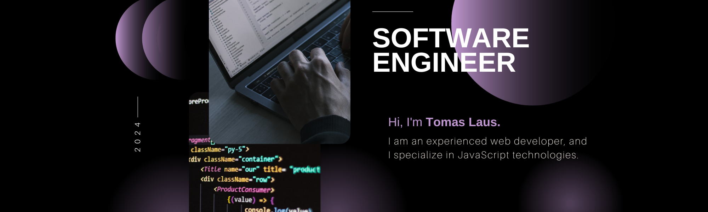

 
 
 

## 🌐 Portfolio:

<!--  
  -->

## 💻 Tech Stack:
<h3>※ Front</h3>

                   

<h3>※ Back</h3>

               

<h3>※ Tools</h3>

          

## 📊 GitHub Stats:

### ✍️ Random Dev Quote

<!-- ## 📨 Contact
 -->

